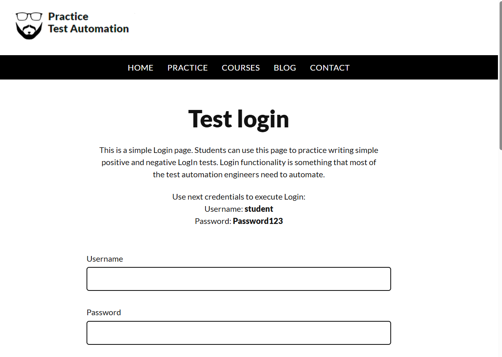
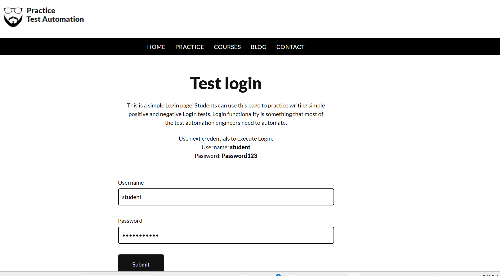
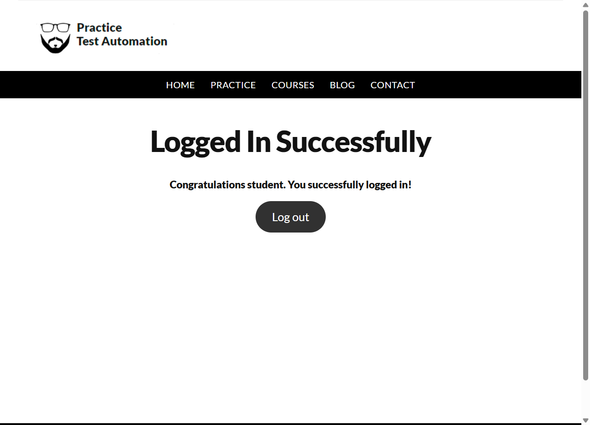

CODTECH Internship Task-1  
Automated Login Test using Selenium  

Company: CODTECH IT SOLUTIONS  
Intern Name:GOGULAPATI LAKSHMI POORNIMA 
Intern ID: CTIS5653 
Domain: Software Testing  
Duration: 4 Weeks  
Mentor: NEELA SANTOSH

------------------------------------------------------------

Objective  

The objective of this project is to automate the login functionality of a web application using Selenium WebDriver with Python. The automation script verifies successful login and logout operations.

------------------------------------------------------------

Description  

This project uses Selenium WebDriver to automate the login process of a practice web application. The script opens the browser, enters valid credentials, performs login, verifies successful login, and logs out. Screenshots are captured as proof of execution.

------------------------------------------------------------

Tools Used  

Python  
Selenium WebDriver  
Chrome Browser  

------------------------------------------------------------

Test Steps  

1. Launch Chrome browser  
2. Navigate to login page  
3. Enter username and password  
4. Click on login button  
5. Verify successful login  
6. Capture screenshots  
7. Logout from application  
8. Close browser  

------------------------------------------------------------

How to Run  

1. Install Python and Selenium  
2. Download ChromeDriver  
3. Run the script using:  
   python test_login.py  

------------------------------------------------------------

Files in Repository  

test_login.py  
test_execution_report.txt  
login_success.png  
login_success2.png  
login_success3.png  
README.md  

------------------------------------------------------------

Proof of Execution  

Login Screenshot 1  

Login Screenshot 2  

Login Screenshot 3  

------------------------------------------------------------

Conclusion  

The Selenium automation script successfully executed the login and logout process. All steps were completed as expected and documented with screenshots.
